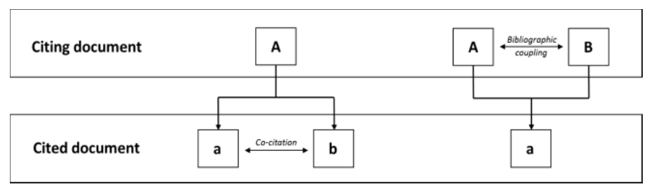

# 耦合 {#Coupling}

可以包含
这里主要参考了 Aria, M. & Cuccurullo, C. (2017). bibliometrix: An R-tool for comprehensive science mapping analysis, Journal of Informetrics, 11(4), pp 959-975, Elsevier, DOI: 10.1016/j.joi.2017.08.007 (link)
M.J. Cobo,  A.G. López‐Herrera,  E. Herrera‐Viedm,a  F. Herrera (2011).
Science mapping software tools: Review, analysis, and cooperative study among tools,
JOURNAL OF THE AMERICAN SOCIETY FOR INFORMATION SCIENCE AND TECHNOLOGY, 62(7):1382–1402

## Bibliographic coupling

```{r echo = FALSE, out.width = "90%"}

```


```{r message=FALSE, warning=FALSE}
# Load Packages
library(tidyverse)
library(stringr)
```


Converting your isi collection into a bibliographic dataframe
```{r message=FALSE, warning=FALSE}
scient_df3 <- read_tsv("data/dataset/savedrecs_utf.txt", quote = "", col_names = TRUE) 

```


```{r}
colnames(scient_df3)
```


预处理非常必要
```{r}
scient_df33 <- scient_df3 %>% 
            as.data.frame() %>% 
            mutate_all(funs(str_replace_all(., "\\s+", " "))) %>% 
            mutate(UT = str_replace(UT, "WOS:", "ISI")) %>% 
            mutate(DB = "ISI", ER = "") %>% 
            mutate_if( is_character, str_to_upper) %>%             
            mutate_all(as.character) %>% 
            mutate_at(vars(PY), as.numeric) %>%  
	          mutate(AU = 
	           str_replace_all(AU, c("," = " ", "\\." = "", "\\s+" = " ") ) %>% str_trim() 
	              )
```


如果做（文章与参考文献的耦合），不应该把作者unnest()
```{r}
tb <- scient_df33 %>% select(AU, CR) %>% 
	   #slice(1:10) %>%
	   mutate(id = row_number()) %>%
       transform(
  	      #AU = str_split(AU, "; ") %>% map(unique),
          CR = str_split(CR, "; ")
       ) %>%
  	   #unnest(AU, .drop = FALSE) %>% 
       unnest(CR, .drop = FALSE) %>%
       mutate(CRlist = str_split(CR, ",") %>% map(unique)) %>%
       mutate(length = map_int(CRlist, ~ length(.)) ) %>%
       filter(length > 3 ) %>%
       mutate(fisrt = map_chr(CRlist, ~ first(.)) %>% map_chr(str_trim),
               Year = if_else(length > 3, map_chr(CRlist, 2), "NA"),
          	     SO = if_else(length > 3, map_chr(CRlist, 3), "NA") %>% map_chr(str_trim)
             ) %>%
	     mutate(DOI = str_extract(CR, "DOI\\s+([^,]*)") %>% str_replace("\\[", "")) %>%
       filter(!is.na(DOI))
```


```{r}
glimpse(tb)
```

稀疏矩阵太大，还是用tidy大法好
```{r}
dummy_sparse <- tb %>% count(id, DOI) %>% rename(row = id, column = DOI, value = n)
dummy_sparse
```

相当于矩阵转置
```{r}
dummy_sparse_t <- dummy_sparse %>% rename(row = column, column = row) 
dummy_sparse_t
```


计算 $C = A \times A^t$
```{r}
rs <- dummy_sparse %>%
  inner_join(dummy_sparse_t, by = c("column" = "row")) %>%
  # take the row id from the first matrix, column id from the second
  group_by(row, column = column.y) %>%
  # and calculate dot products
  summarise(value = sum(value.x * value.y)) #%>%
  # use spread to convert back to a dense representation
  #spread(column, value, fill = 0)

rs
```


```{r}
library(tidygraph)
library(igraph)
library(ggraph)

rs %>%
  as_tbl_graph() %>%
  ggraph(layout = 'kk') + 
  geom_edge_fan(aes(edge_alpha = value, edge_width = value)) +
  geom_node_point(size = 1) +
  geom_node_text(aes(label = name), repel = TRUE, 
                 point.padding = unit(0.2, "lines")) 
```


## 用`sicnu_set`看看吧
```{r}
glimpse(sicnu_set)
```


`CR` 为空，更新`complete_set`数据后再做


