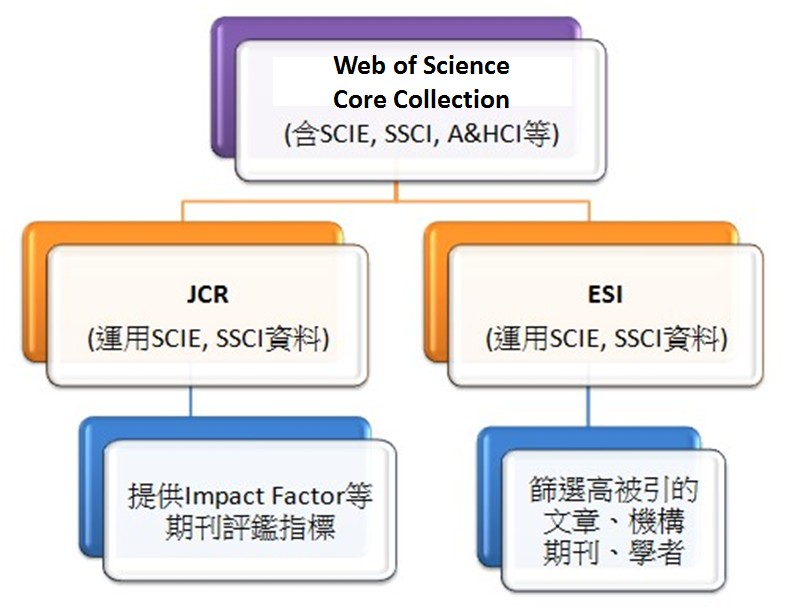
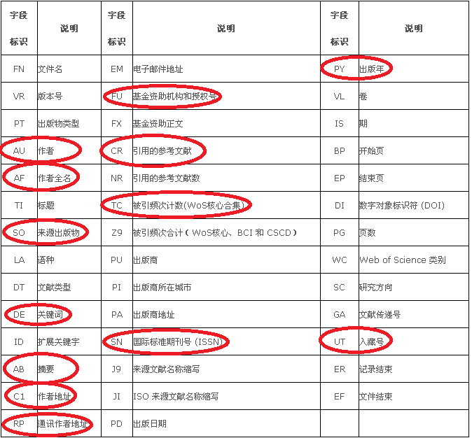

# 学科结构与发展 {#develop}

## PROS
关于文献计量的数据库很多，比如PROS，Arxiv等等，对PROS和Arxiv数据集的分析，另外单独介绍。


## Web of Science

我们选择Web of Science，原因是因为当前ESI学科是各高校关注的热点，而Web of Science数据库是ESI的上游数据库，挖掘的空间更大。

```{r echo = FALSE, out.width = "60%", fig.cap= "ESI与Web of Science的关系图."}

```


Web of Science数据库的题录数据结构如下表：

```{r echo = FALSE, out.width = "90%"}

```


## 数据集的构建
由于wos网站限制每次只能下载500条记录，因此每个学校的题录文件（一个文件夹）存放不止一个txt文件。具体文件结构如下：

```{r echo = FALSE, out.width = "70%"}
#system("tree ./data/Record")
knitr::include_graphics("images/dir_tree.PNG")
```

除了题录数据，还包括辅助的数据集

| 编号 | 名称                    | 简介            | 变量数量 | 共有变量        |
|------|-------------------------|-----------------|----------|-----------------|
| 1    | web of science          | wos题录         | 13       | University,ISSN |
| 2    | sichuan_shool_encn2.csv | 四川高校的名称  | 2        | University      |
| 3    | esi_plus_cas_IF_set.rds | esi期刊学科分类 | 11       | ISSN            |
|      |                         | 中科院学科分类  |          |                 |
|      |                         | 是否中国SCI期刊 |          |                 |
|      |                         | 期刊影响因子等  |          |                 |
|      |                         |                 |          |                 |


接下来，我们来读取规整文件
```{r message=FALSE, warning=FALSE}
# Load Packages
library(tidyverse)
library(here)
library(fs)
library(knitr)
library(kableExtra)
```


构建读取相应文件的子函数
```{r message=FALSE, warning=FALSE}
read_plus <- function(flnm) {
        read_tsv(flnm, quote = "", col_names = TRUE) %>% 
        #or
        #read_delim(flnm,  delim="\t" , quote = "", col_names = TRUE) %>% 
        select(AU, AF, SO, DE, C1, RP, FU, CR, TC, SN, PY, UT) %>% 
        mutate(University = flnm %>%                 # 加入了学校名
                            str_split("/", simplify = TRUE) %>%
                            .[, length(.) - 1] %>%   # 倒数第二列
                            str_sub(start = 4)
               ) 
}
```

```{r, test}
"G:/Guide_DS_R/63R4IS/data/Record/sichuan/01_Chengdu_Univ_Technol/1-500.txt" %>% 
   str_split("/", simplify = F) %>% 
   map_chr(.,
     ~.x[length(.x) - 1]
     )

```


```{r, eval=FALSE, include=FALSE}
# here("data", "Record", "sichuan") %>%
#  dir_ls(regexp = "*.txt", recursive = TRUE) %>%
#  map(~str_split(., "/", 7, simplify = TRUE))  #%>%
#  #map(4) %>%
#  #map(~str_sub(., start = 1, end = -5))
```


依次迭代读取
```{r message=FALSE, warning=FALSE}
tbl <- here("data", "Record", "sichuan") %>% 
  dir_ls(regexp = "*.txt", recursive = TRUE) %>%  
  map_dfr(~read_plus(.))
tbl
```


测试下呢
```{r}
tbl %>% count(University)
```


读取四川高校的名称
```{r}
sichuan_univ_name <- read_csv(here("data", "map_list",  "sichuan_shool_encn2.csv") )
sichuan_univ_name
```

合并到`tbl`， 形成 `sichuan_set`
```{r}
sichuan_set <- tbl %>% 
               left_join(sichuan_univ_name, by = "University")
```


这里是esi期刊列表数据集， `esi_plus_cas_set  = esiJCR + CAS + chineseJCR` （即，每个期刊的esi学科分类，中科院学科分类，是否是中国JCR期刊），目的是方便今后分析
```{r}
esi_plus_cas_IF_set <- read_rds(here("data", "esiJournalsList",  "esi_plus_cas_IF_set.rds"))
```


将 `esi_plus_cas_IF_set` 合并到 `sichuan_set`， 形成 `complete_set`
```{r}
complete_set <- left_join(sichuan_set, esi_plus_cas_IF_set, by = c("SN" = "ISSN") ) %>% 
               select(University, University_cn, everything()) %>%
               rename(ISSN = SN) %>% 
               mutate(SO = str_to_title(SO))
```


## 数据集的导入
最终，我们围绕四川省各高校，选择Web of Science数据库中的10个维度（上图中红色圈出的部分），然后映射并融合了ESI学科分类、中科院期刊分类、期刊等级以及影响因子等，构建了包含24个维度的完整数据集。


```{r}
#complete_set <- read_rds("data/dataset/complete_set.rds")
glimpse(complete_set)
```

## 各高校对比
建立数据集有很大的好处，比如我们可以很方便的对比四川各高校的科研情况

```{r}
complete_set %>% count(University_cn) %>% arrange(desc(n))
```

被引情况呢
```{r}
complete_set %>% count(University_cn, wt = TC) %>% arrange(desc(n))
```

从未被引用的数量和占比（太讨厌了吧）
```{r}
complete_set %>% group_by(University_cn) %>%
                 summarise(num = n(),
                            not_cited = sum(TC == 0),
                            prop = not_cited/num)  %>% 
                 arrange(desc(prop))
```


##  分析单个学校
看看我们川师的情况吧
```{r message=FALSE, warning=FALSE}
sicnu_set <- complete_set %>% filter(University == "Sichuan_Normal_Univ")  
sicnu_set %>% summarise(count = n()) 
```


```{r}
sicnu_set %>%  
      filter(str_detect(C1, "Sichuan Normal Univ,\\s+([^,]*),")) %>% 
      summarise(count = n()) 
```
为什么少了2各呢？大家想想吧


## 第一作者筛查
```{r}
sicnu_set %>%
      filter(str_detect(C1, "^\\[([^]]+)\\]\\s+Sichuan Normal Univ,\\s+([^,]*),")) %>% 
      summarise(count = n()) 
      
```


## 通讯作者筛查
```{r}
sicnu_set %>%
     filter(str_detect(RP, "Sichuan Normal Univ")) %>% 
     summarise(count = n()) 
```


##  可视化之小试牛刀
川师逐年论文发表情况
```{r}
sicnu_set %>% ggplot() +
              geom_bar(aes(x = PY))
```


##  可视化之初显身手

```{r}
some_univ <- c("四川师范大学", "成都理工大学", "西南科技大学", 
               "成信大", "西南石油大学", "四川农业大学", 
               "四川理工学院", "西华师范大学","西华大学")
some_cate <- c("物理学", "化学", "数学", "工程学", "计算机科学", "材料科学")
```

```{r message=FALSE, warning=FALSE, out.width = "99%"}
library(showtext)
showtext_auto()
complete_set  %>%
  group_by(University_cn, Category_ESI_cn, PY) %>%
  summarise(sumpaper = n()) %>%
  filter(University_cn %in% some_univ,
          Category_ESI_cn %in% some_cate, 
          PY >= 2010
          ) %>%
   ggplot(aes(x = PY, y = sumpaper, group = University_cn, colour = factor(University_cn)) ) + 
   geom_point() +
   geom_line() +
   facet_wrap(vars(Category_ESI_cn), scales = "free") +
   labs(x = NULL, y = NULL, colour = "") +
   ggtitle("我省部分省属高校近几年各学科论文情况", subtitle = '（数据来源 Web of Science）') + 
  guides(fill = guide_legend( nrow = 1, byrow = TRUE)) +
  theme(
     #plot.title = element_text(size = 16),
     #plot.subtitle=element_text(size=14, hjust=0.01, face="italic"),
     legend.box = "horizontal",
     legend.position = "bottom",
     legend.direction = "horizontal"#, 
     #text=element_text(size=14)
     )

```


```{r fig.asp = 0.6, fig.width = 8, out.width = "99%"}
complete_set %>%
  filter(!is.na(Category_ESI_cn)) %>% 
  group_by(University_cn, Category_ESI_cn) %>%
  summarise(sumpaper = n()) %>%
  filter(University_cn %in% some_univ) %>%
  ggplot(aes(x = University_cn, y = Category_ESI_cn, colour = University_cn, fill = University_cn, size = sumpaper)) + 
  geom_point(shape = 21 ) +
  scale_size(range = c(0,20)) +
  xlab("") + ylab("") + 
  ggtitle("我省部分省属高校近几年各学科论文情况", subtitle = '（数据来源 Web of Science）') + 
  theme(legend.position = "none")
```


## 可视化之渐入佳境

```{r message=FALSE, warning=FALSE, fig.asp = 1.1, fig.width = 8, out.width = "99%"}
library(scales)
library(ggiraph)
library(ggiraphExtra)

df_radar <- complete_set %>% 
     filter(!is.na(Category_ESI_cn)) %>% 
     count(University_cn, Category_ESI_cn) %>% 
     spread(Category_ESI_cn, n, fill = 0) %>% 
     mutate_at(vars(-University_cn), funs(rescale)) %>%
     filter(University_cn %in% some_univ) 

ggRadar(data = df_radar, 
        mapping = aes(colour = University_cn),
        size = 2,
        legend.position = "none",
        rescale = TRUE) +
  facet_wrap(vars(University_cn) )
  
```


来点动画吧，(gganimate升级后，该代码无法工作)
```{r eval=FALSE, fig.show='animate', message=FALSE, warning=FALSE, include=FALSE}
library(gganimate)
econ_chart <- complete_set %>% 
     count(University_cn, PY) %>%
     filter(University_cn %in% some_univ) %>% 
     ggplot(aes(PY, n, group = University_cn, colour = University_cn)) +
     geom_line(size = 1, aes(frame = PY, cumulative = TRUE)) + 
     labs(title = "我省部分省属高校近几年各学科论文情况",
          subtitle = '（数据来源 Web of Science）',
          y = "", x = "Years",
          caption = "Source: Web of Science",
          colour = "学校") +
     #theme(plot.background = element_rect(fill = "#cddee7"))  +
     NULL

gganimate(econ_chart, interval = 1, "chart.gif")
  
```


```{r echo=FALSE}
knitr::include_graphics("chart.gif")
```


现在我们可以使用新的 gganimate宏包了
```{r fig.show='animate', message=FALSE, warning=FALSE}
library(gganimate)
ttb <- complete_set %>% 
       filter(University_cn %in% some_univ, !is.na(Category_ESI_cn)) %>% 
       count(University_cn, PY, Category_ESI_cn) #%>%
```


看看这个动画 
```{r message=FALSE, warning=FALSE, out.width = "80%"}
ttb %>% 
  ggplot(aes(x = University_cn, y = Category_ESI_cn, colour = University_cn, fill = University_cn, size = n)) + 
  geom_point(shape = 21 ) +
  scale_size(range = c(0,10)) +
  # Here comes the gganimate code
  labs(title = "{closest_state}") +
  transition_states(PY, state_length = 2, transition_length = 1) +
  enter_fade() + 
  exit_shrink() +
  ease_aes('linear') + 
  xlab("") + ylab("") + 
  theme(legend.position = "none")
```


又来一个
```{r message=FALSE, warning=FALSE, out.width = "80%"}
tsb <- complete_set %>% 
     count(University_cn, PY) %>%
     filter(University_cn %in% some_univ)
 

 
tsb %>% 
  ggplot(aes(PY, n, size = n, colour = University_cn)) +
  #geom_point(alpha = 0.7, show.legend = FALSE) +
  geom_point(alpha = 0.7, show.legend = TRUE) +
  scale_size(range = c(2, 12)) +
  # Here comes the gganimate specific bits
  labs(title = "我省部分省属高校近几年各学科论文情况Year: {frame_time}",
          subtitle = '（数据来源 Web of Science）',
          y = "", x = "Years",
          caption = "Source: Web of Science",
          colour = "学校") +
  transition_time(PY) +
  shadow_mark(past = TRUE) +  #equivalent to cumulative= TRUE in the old package
  ease_aes('linear')
```


再来一个


```{r message=FALSE, warning=FALSE, include=FALSE}
stocks <- sicnu_set %>% 
          group_by(Category_CAS, Degree_CAS) %>%
          summarise(value = n())
stocks
```

```{r message=FALSE, warning=FALSE, include=FALSE}
shapenumber <- stocks %>% 
               complete(
                 Category_CAS, Degree_CAS,
                 fill = list(value = 0)
               ) %>%
              mutate(Degree_CAS = paste0("degree", Degree_CAS))
shapenumber
```

```{r message=FALSE, warning=FALSE}
library(RColorBrewer)
library("viridis")

mycols <- brewer.pal(9,"Oranges")[2:8]  

theme_set(theme_bw())

shapenumber %>% 
   filter(!is.na(Category_CAS)) %>%
   ggplot(aes(y = Category_CAS, x = Degree_CAS, fill = value)) + 
   geom_tile(color = "white") +
   scale_fill_gradientn(colours = mycols) +
   geom_text( aes(label = round(value,2)),
              size = 6
             ) +
   labs(x = NULL, y = NULL) +
   ggtitle("四川师范大学近几年各学科论文发表情况", subtitle = '（数据来源 Web of Science）') + 
   guides(fill = guide_legend(
                     title = "数量"
                     #reverse = TRUE
                    )
          ) +
   theme(
     plot.title = element_text(size = 18),
     plot.subtitle = element_text(size = 14, hjust = 0.01, face = "italic"),
     legend.title = element_text(size = 14),
     legend.position = "top",
     legend.justification = c(1,0),
     legend.margin = margin(0, 0, 0, 0),
     axis.text.x = element_text(margin = margin(0.4, unit = "cm")),
     text = element_text(family = "fzxbsj",size = 20)
     #plot.margin = unit(c(0, 0, 0, 0), "cm") #top, right, bottom, left
     ) +  
     scale_x_discrete(expand = c(0,0), 
                      labels = c("degree1" = "一区", "degree2" = "二区", 
                                 "degree3" = "三区", "degree4" = "四区")
                     ) +
    scale_y_discrete(expand = c(0,0)) 
```


##  更多

还可以做各种统计和可视化，在后面的章节一一展示吧
