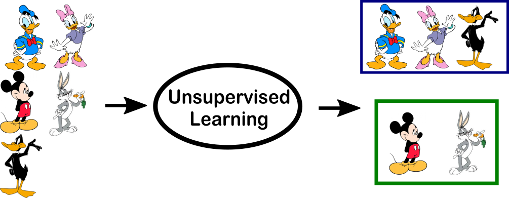

# 共现矩阵在信息服务中的应用 {#Occurence}

```{r echo = FALSE, out.width = "90%"}

```

共现矩阵及其在信息服务中的应用.

## 邻接矩阵
|        | kw1 | kw2 | kw3 |   |
|--------|-----|-----|-----|---|
| paper1 |     |     |     |   |
| paper2 |     |     |     |   |
| paper3 |     |     |     |   |


邻接矩阵可以产生两个矩阵：共现矩阵和距离矩阵。

### 共现矩阵
|     | kw1 | kw2 | kw3 |   |
|-----|-----|-----|-----|---|
| kw1 |     |     |     |   |
| kw2 |     |     |     |   |
| kw3 |     |     |     |   |


### 距离矩阵
|        | paper1 | paper2 | paper3 |   |
|--------|--------|--------|--------|---|
| paper1 |        |        |        |   |
| paper2 |        |        |        |   |
| paper3 |        |        |        |   |


这里表中的列，关键词kw1,kw2,kw3是可以替换成**作者**、**合作机构**、**参考文献**等。
而表中的行的paper1,paper2,paper3可以替换成文章的属性如**所属学科**、**所发表的期刊**、**等级**等


聚类方法有很多种，我们这里用到的是**层级聚类**


## 聚类案例1：主题词聚类


```{r message=FALSE, warning=FALSE}
# Load Packages
library(tidyverse)
library(stringr)
library(cluster)    
library(dendextend)
library(lsa)
library(ggdendro)
```


```{r message=FALSE, warning=FALSE}
scient_df3 <- read_tsv("data/dataset/savedrecs_utf.txt", quote = "", col_names = TRUE) 

```


选择文章的唯一识别码UT（可能后期会提取关键信息作为识别码），主题词ID这2列
```{r}
df <- scient_df3 %>% 
  select(UT, ID) %>% 
  separate_rows(ID, sep = ";") %>% 
  add_count(UT, ID)  %>% 
  distinct() %>% 
  spread(ID, n) %>% 
  mutate_all(~replace_na(., 0)) %>% 
  column_to_rownames(var = "UT") %>% 
  select_if( ~sum(.) > 5 ) %>%           # select wordfrequence >50
  as.matrix() %>% 
  t()

#head(df)
```

不应该将所有文章都来做主题词聚类，后面要做筛选，比如（某个主题+被引比较多）的才做聚类分析


聚几个类？事实上不需要这个。因为，和kmeans聚类不同的是，层级聚类不需要指定聚类数量。
```{r}
library(factoextra)
fviz_nbclust(df, kmeans, method = "wss") + 
   geom_vline(xintercept = 6, linetype = 2)
```


计算距离
```{r}
hc <- df %>%  
      dist(method = "euclidean") %>% 
      hclust(method = "ward.D2") 
```


可以tidy?
```{r}
library(broom)
# tidy(hc) # ok for kmeans, but not yet for hclust
```


可视化
```{r}
# plot 0
plot(hc, cex = 0.6)
rect.hclust(hc, k = 6, border = 2:5)
```


```{r}
# plot 1
library(ggdendro)
ggdendrogram(hc, theme_dendro = FALSE)
```


```{r message=FALSE, warning=FALSE}
# plot 2
library(factoextra) 

#fviz_dend(hc, cex = 0.5)

fviz_dend(hc, k = 4, # Cut in four groups
          cex = 0.5, # label size
          k_colors = c("#2E9FDF", "#00AFBB", "#E7B800", "#FC4E07"),
          color_labels_by_k = TRUE, # color labels by groups
          rect = TRUE # Add rectangle around groups
)
```


## 聚类案例2：若干学校的聚类
```{r}
complete_set <- read_rds("data/dataset/complete_set.rds")
```
先整理成如下样式

|       | dis1 | dis2 | dis3 | dis4 |
|-------|------|------|------|------|
| univ1 |      |      |      |      |
| univ2 |      |      |      |      |
| univ3 |      |      |      |      |

然后求出相似矩阵。

```{r}
SimMatrix <- complete_set  %>%
  group_by(University_cn, Category_ESI_cn) %>%
  summarise(n = n()) %>% 
  filter(!is.na(Category_ESI_cn)) %>% 
  spread(Category_ESI_cn, n) %>% 
  mutate_all(~replace_na(., 0)) %>% 
  ungroup() %>% 
  mutate_at(vars(-University_cn), funs(./sum(.)) ) %>%
  column_to_rownames(var = "University_cn") %>%
  as.matrix() %>%
  t() %>%
  cosine()
  
  
  #mutate_at(vars(-University_cn), as.numeric) %>%
  #mutate_at(vars(-University_cn), ~scale(., center = T, scale = T))
  
SimMatrix 
```


计算距离矩阵，并作聚类可视化
```{r}
df <- 1 - SimMatrix

# Ward's method
hc <- df %>%  
  dist(method = "euclidean") %>% 
  hclust(method = "ward.D2") #  method = "complete" | "average"
```


```{r message=FALSE, warning=FALSE}
# plot 1
plot(hc, cex = 0.6)
rect.hclust(hc, k = 6, border = 2:5)
```


```{r}
# plot 2
library(factoextra) 

# 1
fviz_dend(hc, cex = 0.5)


# Cut in 4 groups and color by groups
fviz_dend(hc, k = 4, # Cut in four groups
          cex = 0.5, # label size
          k_colors = c("#2E9FDF", "#00AFBB", "#E7B800", "#FC4E07"),
          color_labels_by_k = TRUE, # color labels by groups
          rect = TRUE # Add rectangle around groups
)


# Cut tree into 6 groups
sub_grp <- cutree(hc, k = 4)

fviz_cluster(list(data = df, cluster = sub_grp),
             palette = c("#2E9FDF", "#00AFBB", "#E7B800", "#FC4E07"),
             ellipse.type = "convex", # Concentration ellipse
             repel = TRUE, # Avoid label overplotting (slow)
             show.clust.cent = FALSE)
```


```{r message=FALSE, warning=FALSE}
# plot 3
library(ggdendro)#https://github.com/andrie/ggdendro
library(showtext)
showtext_auto()
ggdendrogram(hc, rotate = TRUE, 
			 size = 4, theme_dendro = FALSE) +
	labs(x = "", y = "")

```

