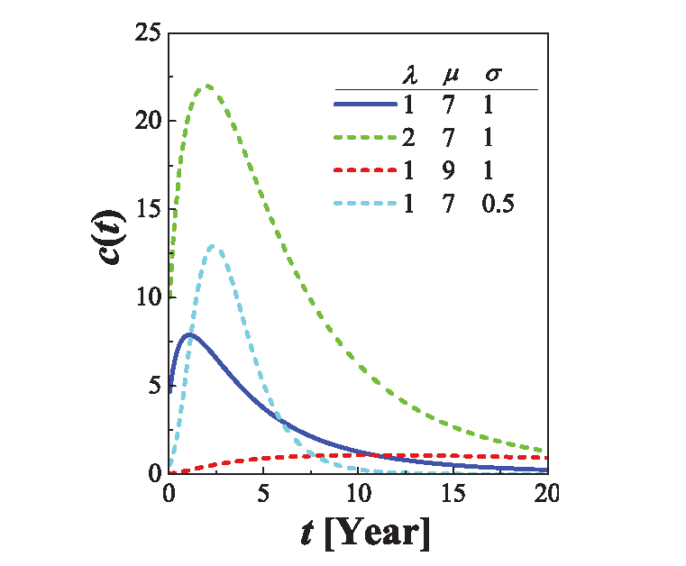

# 预测 {#prediction}

预测不好写啊，这里包含发文量的预测和引文量的预测。先从学科相关性说起吧

## 学科发展的相关性

我们选择四川农业大学的数据来看看。
```{r message=FALSE, warning=FALSE}
scau_set <- complete_set %>%
  filter(University == "Sichuan_Agr_Univ") %>%
  filter(!is.na(Category_ESI_cn))
```

```{r}
scau_set %>% count(Category_ESI_cn, PY)
```


```{r}
df_scau <- scau_set %>%
  count(Category_ESI_cn, PY) %>%
  spread(Category_ESI_cn, n, fill = 0) %>%
  select(-PY)

# Correlation matrix
corr <- round(cor(df_scau), 1)
```


```{r message=FALSE, warning=FALSE, out.width="99%"}
library(corrplot)
corrplot(corr, order = "hclust", tl.cex = 1, addrect = 8)
```

ESI学科分类对生命科学领域情有独钟啊，谁叫它那么重要！


## 发文量的预测
用机器学习的套路搞搞
```{r}
train_set <- scau_set %>%
  filter(!PY %in% c("2016")) %>%
  count(Category_ESI_cn, PY) %>%
  rename(paper = n, year = PY) %>%
  group_by(Category_ESI_cn) %>%
  nest()

test_set <- scau_set %>%
  filter(PY %in% c("2016")) %>%
  count(Category_ESI_cn, PY) %>%
  rename(paper = n, year = PY) %>%
  group_by(Category_ESI_cn) %>%
  nest()

set <- left_join(train_set, test_set, by = "Category_ESI_cn")
set
```


```{r}
set %>% unnest(data.x)
```


## 建模

```{r message=FALSE, warning=FALSE}
library(broom)
library(modelr)

fit_model <- function(df) lm(paper ~ year, data = df)
get_rsq <- function(mod) glance(mod)$r.squared
get_output <- function(mod) augment(mod)


master <- set %>%
  mutate(
    model = map(data.x, fit_model),
    predictions = map2(data.y, model, add_predictions),
    resids = map2(data.x, model, add_residuals),
    glance = map(model, broom::glance),
    tidy = map(model, broom::tidy),
    augment = map(model, broom::augment)
  )

master
```


```{r}
master %>%
  unnest(glance) %>%
  select(Category_ESI_cn, r.squared) %>%
  arrange(-r.squared)
```


```{r fig.asp = 0.8, fig.width = 6, out.width = "99%"}
selected <- master %>%
  unnest(glance) %>%
  filter(r.squared >= 0.75)

master %>%
  unnest(glance) %>%
  ggplot(
    mapping = aes(x = Category_ESI_cn, y = r.squared, label = Category_ESI_cn)
  ) +
  geom_point() +
  geom_text(check_overlap = TRUE, na.rm = TRUE) +
  theme(
    axis.line = element_blank(),
    axis.text.x = element_blank(),
    text = element_text(size = 14)
  ) +
  geom_point(data = selected, aes(x = Category_ESI_cn, y = r.squared), colour = "red")
```

绝大部分是线性的


```{r}
selected <- master %>%
  unnest(glance) %>%
  filter(r.squared >= 0.75)
```


```{r}
selected %>% unnest(data.x)
```


```{r fig.asp = 0.7, fig.width = 8, out.width = "99%"}
selected %>%
  unnest(data.x) %>%
  ggplot(mapping = aes(x = year, y = paper, colour = Category_ESI_cn)) +
  geom_point() +
  geom_smooth(method = lm, se = FALSE) +
  facet_wrap(~Category_ESI_cn) +
  theme(legend.position = "none")
```


```{r}
checkdata <- selected %>%
  unnest(predictions) %>%
  select(Category_ESI_cn, data.y, pred) %>%
  unnest(data.y, names_repair = "universal")

checkdata
```


```{r}
compare <- checkdata %>%
  mutate(delta = abs((paper - pred) / paper)) %>%
  select(Category_ESI_cn, year, paper, pred, delta) %>%
  arrange(delta)

compare
```


```{r fig.asp = 0.7, fig.width = 8, out.width = "99%"}
library(showtext)
showtext_auto()

selected %>%
  unnest(data.x) %>%
  ggplot(mapping = aes(x = year, y = paper, colour = Category_ESI_cn)) +
  geom_point() +
  geom_smooth(method = lm, se = FALSE) +
  geom_point(data = compare, mapping = aes(x = year, y = paper), colour = "black") +
  geom_point(data = compare, mapping = aes(x = year, y = pred), colour = "red") +
  facet_wrap(~Category_ESI_cn, scales = "free") +
  labs(x = NULL, y = NULL, colour = "") +
  theme(legend.position = "none")
```


这种方法准确性比较还算高，而可以用来发文预测。


## 引文量的预测

论文发表后其学术影响力可以被预测？（我想影响引文量的因素很多，我也不知道有哪些。）

在学校规划中规划化学学科为ESI冲刺学科，那么很自然地一个问题是，化学学科未来需要多少科研产出才能保证其学术影响力达到该学科的ESI阈值？


一般来说，单篇论文发表后，其学术影响力（即被引情况）往往是随机的，但对于大量文献，其发表后受到关注的整体特征却是有规律可循的，它有一个从不为人知，到被发现被引用，再到新技术出现后趋于沉寂，完整的生命周期。

```{r echo = FALSE, out.width = "60%"}

```


近年来文献^[D. Wang, C. Song, A.-L. Barabási, Science 342, 127 - 132 (2013).]研究给出了论文发表后其学术影响力（被引用总次数）随时间变化的动力学模型，即WSB模型。
该模型一定程度上可以预测某一学科的科研论文未来若干年的被引用情况，模型的数学表达式如下：

\begin{equation}
c^t_i = m\left[ e^{ \frac{\beta\eta_j}{A} \Phi\left( \frac{\ln t -\mu_j}{\sigma_i}\right)} -1\right]  \equiv 
 m\left[ e^{ \lambda_j \Phi\left( \frac{\ln t -\mu_j}{\sigma_i}\right)} -1\right]  
 (\#eq:binom)
\end{equation}

其中$\Phi$为累积分布函数

$$
 \Phi(x)  \equiv 
(2\pi)^{-1/2}\int_{-\infty}^x e^{-y^2/2} \,\mathrm{d} y
$$

等式中，$\lambda$为即时性因子，$\mu$为相对重要性因子，$\sigma$为衰减因子，这三个重要参数决定了引文分布函数。显然，不同的学科、不同等级的文章具有不同的引文分布。

```{r echo = FALSE, out.width = "90%"}
knitr::include_graphics("images/prediction.png")
```

那么基于这一数学模型，不仅可以预测未来学科发展趋势，而且可以实现超前谋划和战略预判。
例如化学学科要冲刺ESI，那么近十年论文被引总量就必须达到一个阈值。
而完成这个引文阈值，以当前的科研发展规模和速度是不够的。因此必须提前谋划和重新布局，即化学学科未来五年至少要以怎么样的增速和结构持续发展，才能保障这一既定目标的完成。
而这里等式\@ref(eq:binom)可以给出实现ESI冲刺的科研产出下限。


